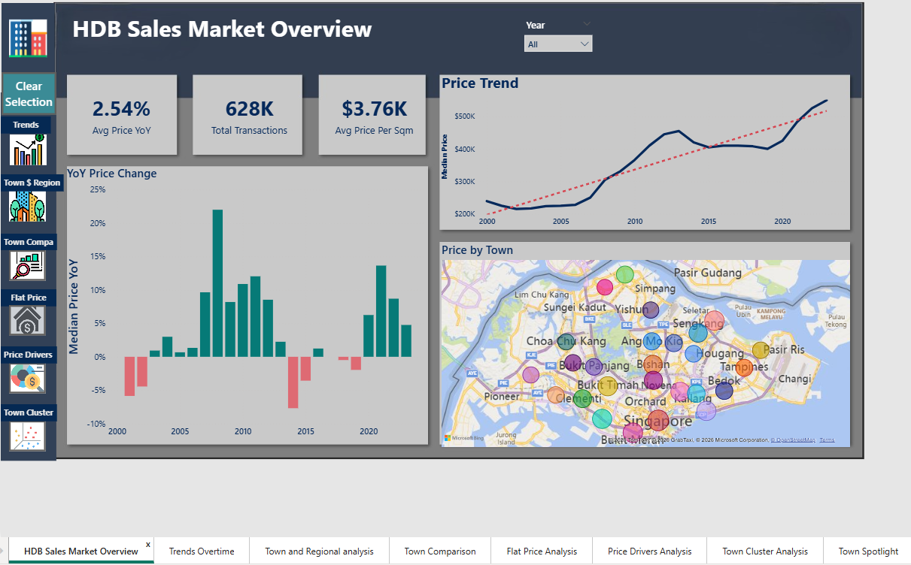
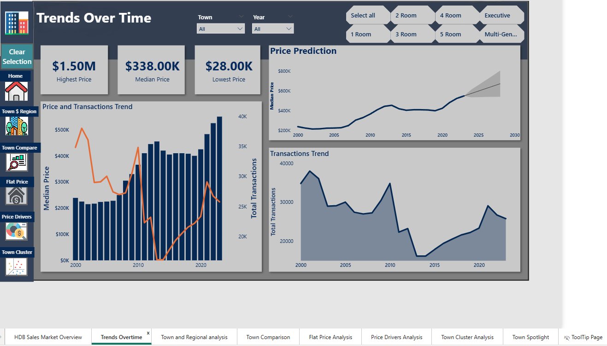
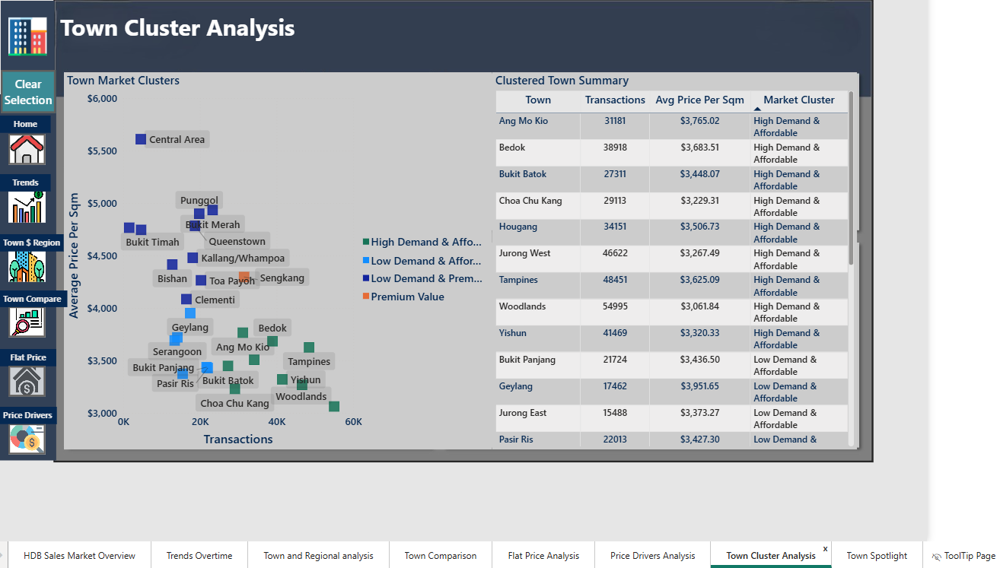
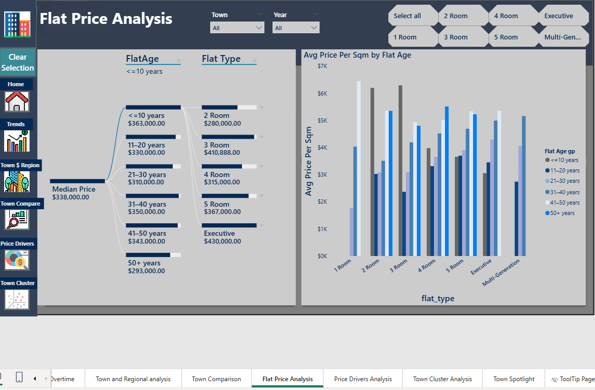

# Singapore HDB Resale Price Analysis

## Project Overview
This project analyzes Singapore HDB resale transaction data to identify pricing trends, town and region level performance, and identify price drivers.

## Business Problem

Singapore’s public housing resale market is influenced by multiple factors such as location, flat type, floor area, and flat age. 
Understanding these factors helps identify pricing patterns and market demand across different towns.
This project aims to analyze historical HDB resale transactions to uncover pricing trends and identify key factors influencing resale values.

## Analytical Approach

The analysis was conducted using SQL and Power BI.
Key steps included:
- Cleaning and preparing the resale dataset
- Performing SQL-based exploratory data analysis
- Calculating metrics such as price per square meter
- Analyzing town and region level price differences
- Building interactive Power BI dashboards to visualize trends and comparisons

## Tools Used
- SQL
- Power BI
- Dax
- Power Query

## Key Analysis
- Analyze long-term market trends (2000–2023)
- Compare regional-level prices
- Analyse town-level clusters
- Identify key factors influencing resale value
- Provide insights and recommendations for stakeholders

## Dashboard Preview

### HDB Sales Overview

### Resale Price Trend

### Town Region Analysis

### Town Clusters

### Flat Price Analysis

## Key Insights

- HDB resale prices have shown long-term appreciation despite short-term fluctuations
- Mature towns such as Queenstown and Bukit Merah show significantly higher average resale prices.
- Larger flat types generally command higher resale values compared to smaller units.
- Price per square meter varies considerably across towns, reflecting differences in location demand.
- Older flats tend to have slightly lower resale prices compared to newer flats.
- Market movements align closely with macroeconomic and policy shifts.

## Recommendations

- Buyers seeking affordable options may consider non-mature towns, older flats, or lower floors, where price per square meter is lower.
- Investors may focus on towns with strong historical price growth.
- Policymakers can use these insights to monitor housing affordability trends across regions.
- Analysts should consider flat age, size, floor, and macroeconomic factors (e.g., recession periods) when analyzing or forecasting prices.

 
## Project Structure

── data                # Contains datasets used for analysis
   
   
         ├── hdbsaleprices.txt # Google Drive link to 23-year HDB resale dataset
    
         ├── region.csv        # Local file mapping towns to regions

         │── README.md         # Description of datasets and file usage

│
├── PowerBI/              # Power BI reports
│   └── README.md         # Overview of dashboards and features (interactive visuals, drill-through, filters, Customized tooltips)
│
├── screenshots/          # Screenshots of dashboards and key analysis visuals
│   └── README.md         # Explains what each screenshot represents
│
├── SQL/                  # SQL scripts used analysis
│   └── README.md         # Description of SQL scripts and queries
│
├── presentation/         # Project presentation slides
│   └── README.md         # Overview of slides and key points covered
│
└── README.md             # Main project README providing overall project overview, objectives, and insights     				
